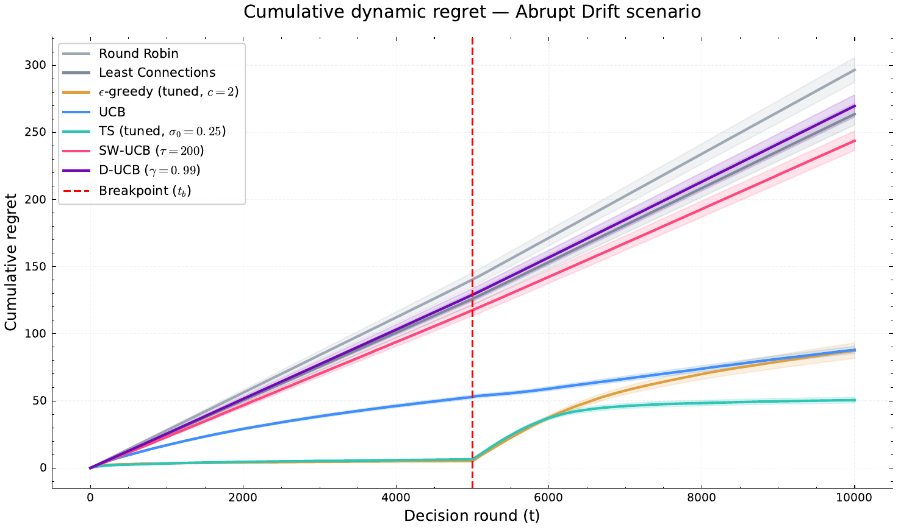
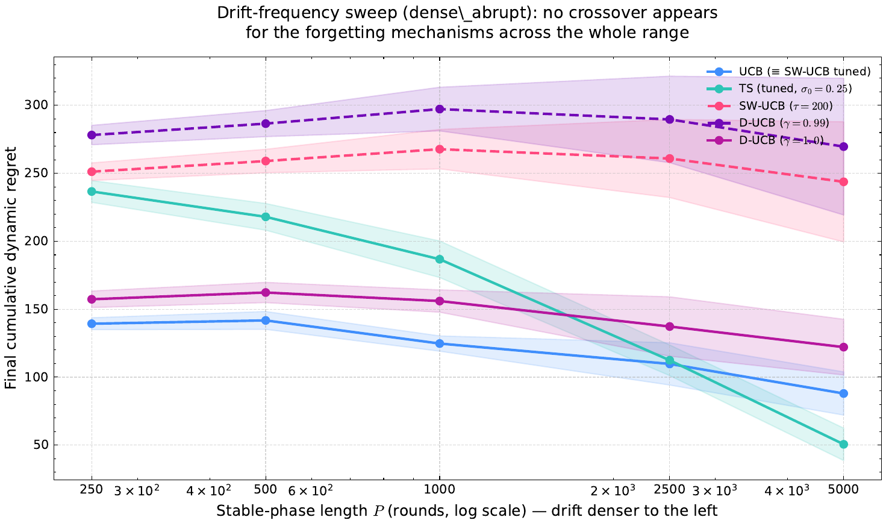
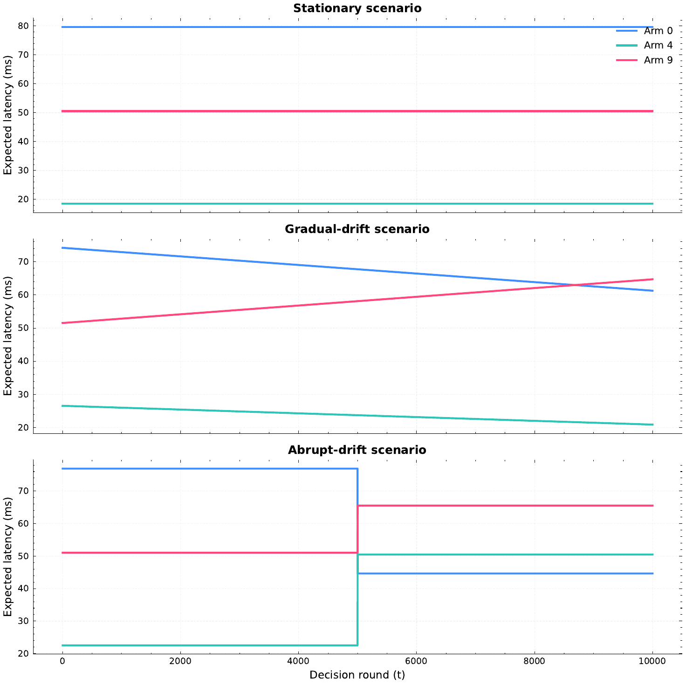
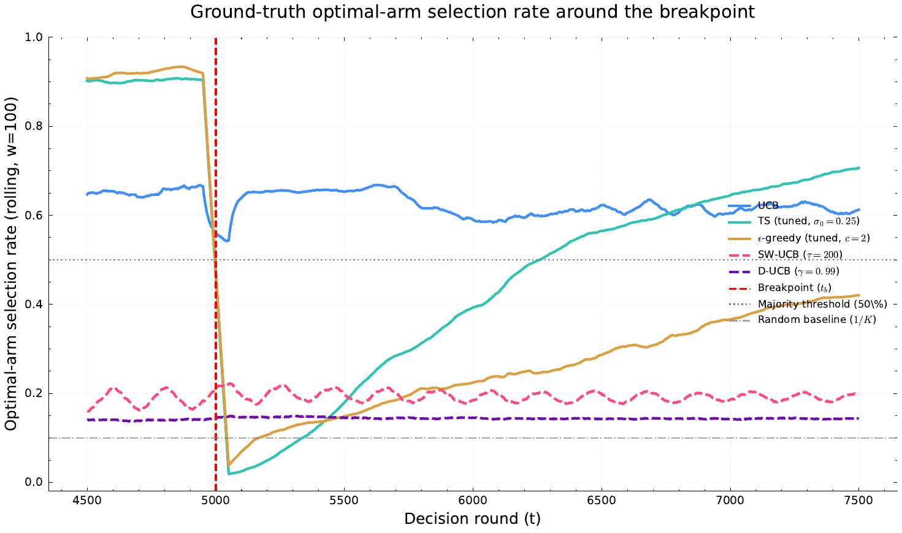

# bandit-load-balancing-benchmark

A controlled study of **multi-armed bandit policies for adaptive request routing**, run under
stationary and non-stationary load, with a deliberately equal tuning budget for every
algorithm.

The headline is not "bandits are good at load balancing" — they are, and that was expected.
The headline is that **algorithm rankings in this literature depend on how much tuning each
algorithm received**, and most empirical comparisons do not say.



*Cumulative dynamic regret under abrupt drift, breakpoint at t = 5000. Round Robin and Least
Connections accumulate regret linearly; the bandit policies flatten out. The interesting part
is not the gap to the baselines — it is that the two algorithms specifically designed for
non-stationarity (SW-UCB, D-UCB) sit above plain UCB.*

---

## Three findings

### 1. Rankings reverse under a fair tuning budget

Every policy was given a grid search of the same size on held-out tuning instances. Under
default ("textbook") configurations the ordering matched expectation. Under equal tuning it
inverted.

| Algorithm | Config | Stationary | Gradual drift | Abrupt drift |
|---|---|---|---|---|
| ε-greedy | default `c=0.1` | 110.68 ± 187.84 | 343.50 ± 394.07 | 150.38 ± 107.68 |
| ε-greedy | **tuned** `c=2` | **7.40 ± 6.53** | 59.84 ± 105.88 | 87.35 ± 70.16 |
| Thompson Sampling | default `σ₀=1` | 57.12 ± 19.31 | 42.63 ± 11.31 | 102.77 ± 42.85 |
| Thompson Sampling | **tuned** `σ₀=0.25` | 9.16 ± 4.25 | **23.79 ± 31.13** | **50.59 ± 26.23** |

*Final cumulative dynamic regret, T = 10,000, mean ± std over 150 trajectories.*

With default settings, ε-greedy loses clearly to UCB — the textbook result. Under an equal
tuning budget it reaches 7.40 against UCB's 93.24 on the stationary scenario. The published
weakness of ε-greedy in comparative studies is substantially an artefact of the constant
`c = 0.1`: it yields `Σ ε_t ≈ 9.8` exploration rounds across the entire horizon, and violates
the `c > 5` condition of the theorem usually cited to justify it.

> **Any claim of the form "algorithm A beats algorithm B" in empirical bandit work needs the
> qualifier "under which tuning budget."** We report this as a general limitation rather than
> working around it.

### 2. Forgetting never paid for itself — at any drift density tested

Under fair tuning, the optimal configuration of both non-stationary algorithms **degenerated
to no forgetting at all**: SW-UCB's best window was `τ = T`, and D-UCB's best discount was
`γ = 1.0`. Both limits *are* plain UCB.

To test whether denser drift would change this, we swept the stable-phase length
`P ∈ {250, 500, 1000, 2500, 5000}` — from 39 breakpoints down to 1 — with the protocol fixed
in advance and a commitment to report the outcome either way. **No crossover exists anywhere in
the range.**



*Final dynamic regret against stable-phase length P (log scale; drift gets denser to the left).
If forgetting ever paid off, these curves would cross. They do not, anywhere in the range.*

At the densest setting (`P = 250`):

| Policy | Final dynamic regret |
|---|---|
| UCB | **139.3 ± 10.3** |
| SW-UCB (`τ = 200`) | 251.2 ± 13.2 |
| D-UCB (`γ = 0.99`) | 278.2 ± 14.4 |

The mechanism is measurable: forgetting is a tax paid continuously during stable phases, while
its benefit is collected once per breakpoint. At the identification gap of this environment
family (normalised gap ≈ 0.082), a sliding window needs `τ ≳ 3 × 10⁴` to resolve the two best
arms — larger than the entire horizon.

**Scope condition, stated explicitly:** this holds for `K = 10`, large gaps, homogeneous noise
(`CV = 0.447`). Environments with smaller gaps or heavier noise — where UCB's re-identification
cost rises — are the natural place to look for a reversal.

### 3. Bandits beat classical load-balancing policies, consistently

Every bandit policy beat Least Connections on **5/5 evaluation instances across all three
scenarios** (paired *t*-test `p ≤ 0.038` on every comparison). Regret improvement ranged
2.2×–48×, median 5.2×. On the underlying physical quantity:

| Policy | Stationary | Gradual drift | Abrupt drift |
|---|---|---|---|
| Round Robin | 57.60 ms (0.90×) | 58.50 ms (0.88×) | 57.22 ms (0.91×) |
| Least Connections | 51.87 ms (ref) | 51.62 ms (ref) | 52.14 ms (ref) |
| ε-greedy (tuned) | **21.58 ms (2.40×)** | 19.48 ms (2.65×) | 31.20 ms (1.67×) |
| Thompson Sampling (tuned) | 21.72 ms (2.39×) | **18.62 ms (2.77×)** | **28.78 ms (1.81×)** |

*Mean system latency; parenthesis = speedup over Least Connections.*

One caveat worth keeping: this advantage is **conditional on tuning**. At default settings,
D-UCB is *practically* indistinguishable from Least Connections — the gap is a few percent
either way (365.93 vs 357.21 stationary, 631.85 vs 657.74 gradual, 269.65 vs 263.58 abrupt).
It is not *statistically* indistinguishable: the differences are small but consistent in sign
across instances, so the paired test picks them up (`p = 0.0087`, `0.0088`, `0.0367`).

---

## What was pre-registered, and what happened

| | Hypothesis | Outcome |
|---|---|---|
| **H1** | UCB ≈ TS, and both > ε-greedy | ❌ **Rejected on both clauses** — TS beats UCB on stationary (5/5 instances, paired *t* `p = 0.007`) and abrupt drift (5/5, `p = 0.007`), though not on gradual drift (4/5, `p = 0.21`); tuned ε-greedy matches or beats UCB |
| **H2** | D-UCB adapts better than UCB under gradual drift | ❌ **Contradicted** — D-UCB worse on 5/5 instances even at its own optimal setting |
| **H3** | SW-UCB adapts faster than D-UCB after a breakpoint | ⚠️ **No longer well-posed** — both tune to their no-forgetting limits, so there is no forgetting mechanism left to compare |
| **H4** | MAB policies beat static allocation | ✅ **Confirmed** |

Three of four rejected, one in the direction opposite to prediction. That is the point of
fixing the protocol before running it.

---

## Experimental design

```
Servers (arms)        K = 10
Horizon               T = 10,000 rounds
Trajectories          N = 150  (5 instances × 30 seeds)
Latency model         Gamma(k=5, θ), 10–100 ms,  CV = 0.447
Reward                r = l_min / L, online-normalised to [0,1]
Primary metric        dynamic regret (against the time-varying optimal arm)

Scenarios             stationary · gradual drift · abrupt drift (t_b = 5000)
Extended              multi-abrupt (3 breakpoints) · periodic drift (period 2000)
Density sweep         dense_abrupt, P ∈ {250, 500, 1000, 2500, 5000}

Policies              ε-greedy · UCB1 · Thompson Sampling · SW-UCB · D-UCB
Baselines             Round Robin · Least Connections
```



*Expected latency of three representative servers under each scenario. Stationary: the ordering
never changes. Gradual drift: arms cross slowly. Abrupt drift: the ordering inverts at
t = 5000 — the previously worst server becomes competitive and the best one is displaced. The
optimal arm is a moving target, which is why dynamic regret is the right metric.*

Tuning and evaluation use **disjoint instance sets**. Statistical inference treats instances,
not trajectories, as the independent unit (`n = 5`) — paired *t*-test plus Wilcoxon plus
bootstrap CI, reported together rather than cherry-picked.



*Recovery around the breakpoint: rolling share of rounds spent on the new optimal arm. UCB
crosses the majority line almost immediately; Thompson Sampling recovers slowly (variance
shrinkage); the default-configured forgetting policies never leave the neighbourhood of
random choice.*

Every summary number in the report is regenerated by `experiments/make_summary_numbers.py`
from the raw results. None was typed by hand.

---

## ⭐ `lessons/` — twelve pitfalls found by auditing this benchmark

The most reusable part of this repository is not the results. It is
**[`lessons/`](lessons/README.md)**: a catalogue of twelve ways an empirical bandit study can
produce a plausible but wrong conclusion, each one found in *this* work.

Among them: a self-referential adaptation metric that ranked Round Robin as the fastest
adapter; a grid-search optimum sitting on the grid boundary; `N = 150` that was really `N = 5`;
a verification figure that contradicted its own closed form; and a constant used in a
derivation that turned out to be off by a factor of four.

The twelfth was found four weeks after the first eleven were published, **in this README** —
three hand-typed summary numbers that did not survive being recomputed, which is a repeat of
pitfall #10 in the one document the fix for #10 did not cover. They are corrected above; the
entry explaining how they got there is [in the catalogue](lessons/README.md#12-the-catalogue-did-not-stop-pitfall-10-from-happening-again).

---

## Reproducing

Run from the repository root, as modules (the scripts import from `src/`):

```bash
python -m venv .venv && source .venv/bin/activate
pip install -r requirements.txt

python -m experiments.tune                        # grid search on tuning instances
python -m experiments.run_experiments             # main scenarios
python -m experiments.run_sensitivity_experiments # multi-abrupt + periodic
python -m experiments.run_drift_frequency_sweep   # density sweep
python -m experiments.make_summary_numbers        # regenerate every reported figure
python -m experiments.plot                        # figures
```

Or end to end: `bash experiments/tools/run_full_pipeline.sh`

Raw `.pkl` results are not committed (≈18 MB) — the scripts above regenerate them
deterministically from the committed seeds. Aggregated results are in `results/`.

---

## Layout

```
src/            env · policies · simulator · metrics
experiments/    tuning, runs, sweeps, plotting, table generation
results/        aggregated JSON + rendered result tables
figures/        figures used in the report
lessons/        ⭐ twelve pitfalls, with evidence
report/         full report (PDF, Vietnamese, 56 pp.)
```

The full report is in Vietnamese. This README, and `lessons/`, carry the substance in English.

---

## Citation

If the tuning-budget point or the `lessons/` catalogue is useful to you, a link back is
appreciated. The benchmark was built as coursework for an Advanced Algorithms module, as an
individual project.

## License

MIT — see [LICENSE](LICENSE).
